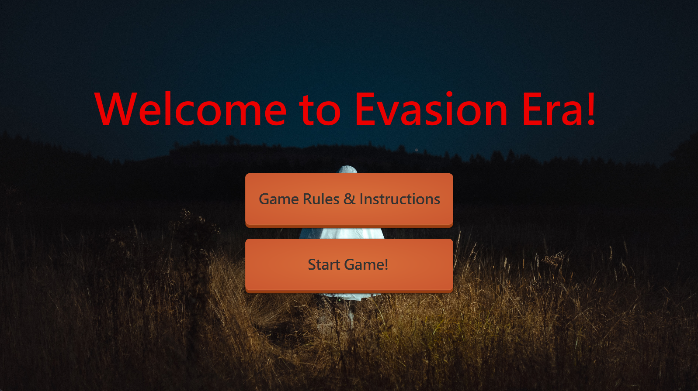
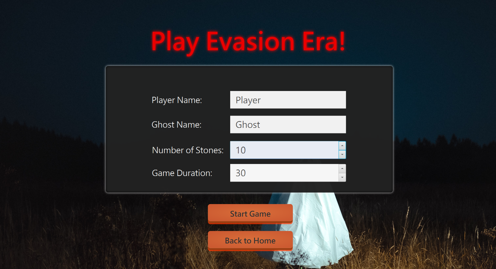
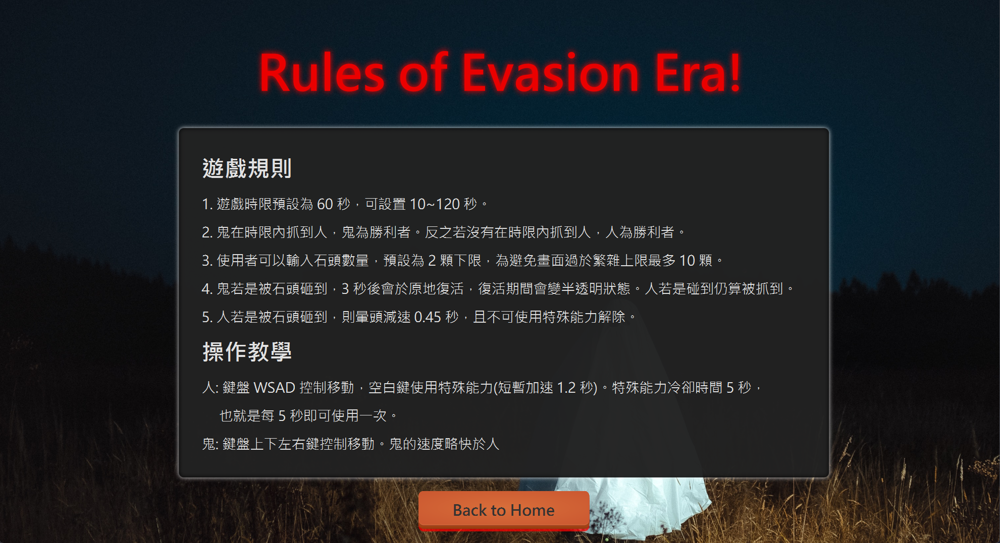
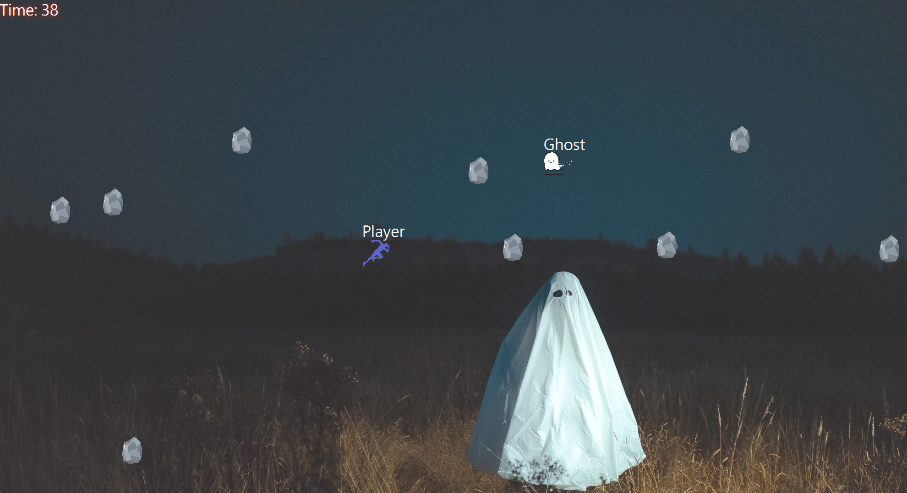
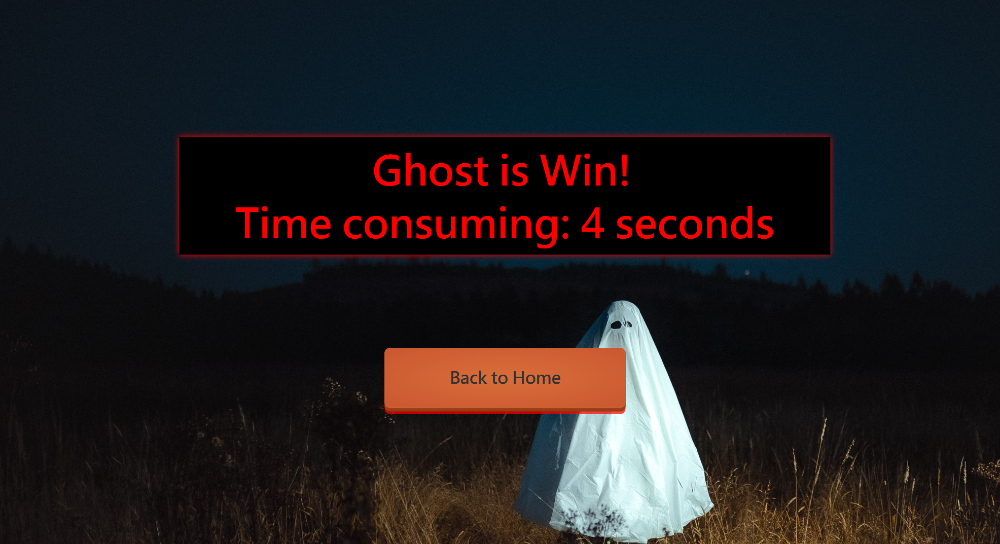

# Evasion Era - 11202 計算機概論 II Final Project



組員: 109403019 鄒翔宇

## 目錄

- [Evasion Era - 11202 計算機概論 II Final Project](#evasion-era---11202-計算機概論-ii-final-project)
    - [目錄](#目錄)
    - [Usage](#usage)
        - [Prerequisite](#prerequisite)
        - [Run in Terminal](#run-in-terminal)
        - [Build](#build)
        - [In IDE](#in-ide)
    - [遊戲簡介](#遊戲簡介)
    - [遊戲流程](#遊戲流程)
        - [首頁 (`home-view.fxml`)](#首頁-home-viewfxml)
        - [遊戲設置畫面 (`game-setup.fxml`)](#遊戲設置畫面-game-setupfxml)
        - [遊戲規則 \& 操作教學 (`rule-view.fxml`)](#遊戲規則--操作教學-rule-viewfxml)
        - [遊戲進行畫面 (`game-view.fxml`)](#遊戲進行畫面-game-viewfxml)
        - [遊戲結束畫面 (`end-view.fxml`)](#遊戲結束畫面-end-viewfxml)
    - [Todo](#todo)
    - [開發工具](#開發工具)
    - [簡報規劃](#簡報規劃)
    - [參考資料](#參考資料)

## Usage

### Prerequisite

- [Java 17.0.7 LTS](https://www.oracle.com/java/technologies/javase/jdk17-archive-downloads.html) (or above)
- [JavaFX 17.0.7 LTS](https://gluonhq.com/products/javafx/) (or above)
- [Maven 3.9.2](https://maven.apache.org/download.cgi) (or above)
- (Optional for dev) [Scene Builder 19.0.0](https://gluonhq.com/products/scene-builder/#download) (or above)

### Clone Project

```bash
git clone
cd evasion-era
```

### Run in Terminal

```bash
mvn clean javafx:run
```

[//]: # (### 打包成可執行檔)

[//]: # ()
[//]: # (1. Build)

[//]: # (    ```bash)

[//]: # (    mvn clean package)

[//]: # (    ```)

[//]: # ()
[//]: # (2. 創建JavaFX運行時映像)

[//]: # (   )
[//]: # (    使用 jlink 打包成 runtime 後執行，記得修改 `/path/to/javafx/sdk` 為自己SDK的路徑。)

[//]: # (   )
[//]: # (3. jlink --module-path "D:\javafx-sdk-17.0.7\lib" --add-modules javafx.controls,javafx.fxml,javafx.media --output javafx-runtime)

[//]: # (   ```bash)

[//]: # (    jlink --module-path /path/to/javafx/sdk --add-modules javafx.controls,javafx.fxml,javafx.media --output javafx-runtime)

[//]: # (    ```)

[//]: # (3. 執行)

[//]: # (    ```bash)

[//]: # (    javafx-runtime/bin/java -jar target/evasion-era-1.0.jar)

[//]: # (    ```)

### In IDE(like IntelliJ IDEA)

添加 VM options 才可執行，記得修改 `path/to/javafx/sdk` 為自己SDK的路徑。

```bash
--module-path path/to/javafx/sdk --add-modules javafx.controls,javafx.fxml,javafx.media
```


## 遊戲簡介

> 文案修改自 ChatGPT-4

**"Evasion Era"**
是一款動態、刺激的雙人避險遊戲。在這個遊戲中，玩家將扮演人或鬼的角色，並在一個充滿飛來飛去的石頭的場景中進行追逐。人的目標是在時間內避開鬼和石頭，盡可能生存到最後；而鬼的目標則是在時間內抓到人。遊戲的挑戰性來自於石頭的數量和速度，以及鬼和人的移動速度。這是一款考驗玩家反應速度和策略的遊戲，帶給玩家無窮的樂趣。

## 遊戲流程

### 首頁 (`home-view.fxml`)

> 於首頁可點選「遊戲規則 & 操作教學」按鈕或「開始遊戲」按鈕。

- 按下「開始遊戲」按鈕後，進入遊戲開始畫面。
- 按下「遊戲規則 & 操作教學」按鈕後，進入遊戲規則 & 操作教學畫面。


### 遊戲設置畫面 (`game-setup.fxml`)

> 可以點選 Back to Home 按鈕回到首頁。

- 使用者輸入鬼和人的名稱、石頭的數量（石頭越多難度越高）
- 設置石頭數量。預設為兩顆下限，為避免畫面過於繁雜上限最多 5 顆。



### 遊戲規則 & 操作教學 (`rule-view.fxml`)

> 觀看完規則可以點選 Back to Home 按鈕回到首頁。

**遊戲規則**

- 遊戲時限預設為 60 秒，可設置 10~120 秒。
- 鬼在時限內抓到人，鬼為勝利者。反之若沒有在時限內抓到人，人為勝利者。
- 使用者可以輸入石頭數量，預設為 2 顆下限，為避免畫面過於繁雜上限最多 10 顆。
- 鬼若是被石頭砸到，3 秒後會於原地復活，復活期間會變半透明狀態。人若是碰到仍算被抓到。
- 人若是被石頭砸到，則暈頭減速 0.45 秒，且不可使用特殊能力解除。

**操作教學**

- 人: 鍵盤 WSAD 控制移動，空白鍵使用特殊能力(短暫加速 1.2 秒)。
    - 特殊能力冷卻時間 5 秒，也就是每 5 秒即可使用一次。
- 鬼: 鍵盤上下左右鍵控制移動。鬼的速度略快於人。



### 遊戲進行畫面 (`game-view.fxml`)

> 在充滿飛來飛去的石頭中進行追逐。

- 用圖片代表鬼和人之角色，並於角色上方顯示名字，角色可以在畫面中任意移動，。
- 鬼的移動速度比人快一點，但人有短暫提速的特殊能力。
- 石頭的初始方向為隨機，增加遊戲的變化性和挑戰性。速度則會在一個速度範圍隨機移動。
- 石頭撞到畫面邊界會加速反彈。
- 左上角會顯示遊戲剩餘時間。



### 遊戲結束畫面 (`end-view.fxml`)

- 顯示獲勝方、耗時。
- 顯示回到開始畫面按鈕。



## Todo

Features

- [x] 首頁
    - [x] 遊戲規則 & 操作教學按鈕
    - [x] 開始遊戲按鈕
- [x] 遊戲規則介紹、操作教學畫面
- [x] 遊戲設定畫面
    - [x] 使用者輸入鬼和人的名稱
    - [x] 設定遊戲時限
    - [x] 選擇石頭數量
- [x] 遊戲進行畫面
    - [x] 人與鬼可以按照鍵盤控制移動(WASD、上下左右)
    - [x] 人可以按下空白鍵使用特殊能力(短暫加速 1.5 秒)
    - [x] 彈來彈去的石頭，人碰到遊戲結束、鬼碰到需要花 3 秒鐘復活
- [x] 遊戲結束畫面
    - [x] 顯示獲勝方、耗時
    - [x] 回到開始畫面按鈕

Improvements & Bugs

- [x] feat: 人與鬼上方會顯示名稱
- [x] feat: 石頭反彈加速
- [x] feat: 遊戲過程介面可以再優化好看一點
- [x] bugs: 重新開始遊戲時，應該要清除上一局的資料
- [x] bugs: 在設置遊戲頁面時，遊戲時間已經在倒數
- [x] feat: 遊戲平衡，實際遊玩發現石頭可以直接把人砸死對於人過於劣勢，因此修改成石頭砸到人會減速 0.45 秒
- [x] feat: 添加背景音樂

## 開發工具

- [IntelliJ IDEA](https://www.jetbrains.com/idea/)
- [JavaFX](https://openjfx.io/)
- [Scene Builder](https://gluonhq.com/products/scene-builder/)
- [JavaFX CSS Reference Guide](https://openjfx.io/javadoc/16/javafx.graphics/javafx/scene/doc-files/cssref.html)

## 簡報規劃

- 封面: 主題、組員
- 開發工具
- 遊戲簡介、規則
- DEMO
- 困難的點
- 未來改善的方向
- 參考資料

## 參考資料

- 按鈕的 CSS 樣式[Button CSS](http://fxexperience.com/2011/12/styling-fx-buttons-with-css/)
- 協作工具[ChatGPT 4.0](https://chat.openai.com/)，主要用於詢問優化程式碼的部分。

- 圖片
    - [首頁背景圖片](https://unsplash.com/photos/I0oihJbNSIc)
    - [Ghost](https://www.clipartmax.com/max/m2H7K9m2G6m2m2N4/)
    - [Player](https://www.pngegg.com/en/png-bnfyu/download)
    - [Stone]()
        - <a href="https://www.flaticon.com/free-icons/rock" title="rock icons">Rock icons created by Icongeek26 -
          Flaticon</a>
- 背景音樂: https://fanlink.to/DarkMystery
